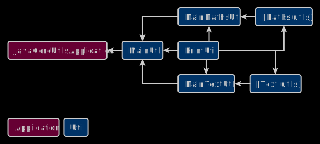

# Java Core Utils

## Description
A set of utilities containing mathematical and textual operations using only Java Core.

## Used tools
* Platform: Spring Boot 2.6.1
* Builder: Gradle
* Languages: Java 8

## Important files
* Builder configuration: /build.gradle

## Backend schema

## Installation
1. Run this project in a development environment

## Release notes
* Project type: Console application
* Date of release: 2 January 2022
* Date of last update: 26 March 2023
* Current version: 2.0
